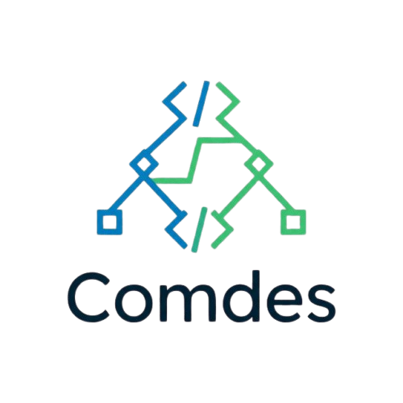

<div align="center">
  
  <h1>Comdes</h1>
  <p><strong>Interactive Compiler Design Learning Platform</strong></p>
</div>

---

<p align="center">
  A visual, semantic-driven web application for mastering Context-Free Grammars, FIRST/FOLLOW set mathematical closure, and simulating production-grade Bottom-Up parsing algorithms (LL, LR, SLR, CLR, LALR).
</p>

## ✨ Features

- **Grammar Engine Validation**: Defines, tests, and validates formal Context-Free Grammars (CFGs). Automatically diagnoses Left-Recursion, Ambiguity, and Missing Non-Terminals.
- **Set Generation**: Compute and view comprehensive `FIRST(&alpha;)` and `FOLLOW(A)` sets.
- **Parsing Algorithms**: Generates Action/Goto discrete transition mapping tables across multiple algorithmic tiers:
  - 🟢 `LL(1)` Top-Down Predictive Parsing
  - 🔵 `LR(0)` Pure Shift/Reduce State Machine
  - 🟡 `SLR(1)` Simple LR (with Follow Sets)
  - 🟠 `CLR(1)` Canonical LR (1-lookahead Context)
  - 🟣 `LALR(1)` Look-Ahead LR (Production Standard)
- **Interactive Visualizers**:
  - Automatically draws step-by-step **Parse Trees** mapping Terminal derivation.
  - Renders the exhaustive DFA (Deterministic Finite Automaton) closure graph using `ReactFlow` for state visualization.
- **Educational Knowledge Base**: Built-in curriculum on the semantics of compilers, algorithms, and algorithm-specific weaknesses. Contains built-in "Practice Grammars" for student exercises.
- **Local Persistence & Privacy**: Grammars can be safely cached and reloaded. The entire application executes completely locally in the browser with `0` backend telemetries required.

## 🚀 Quick Start

Ensure you have Node.js installed, then clone the repository:

```bash
# 1. Clone the repository
git clone https://github.com/your-username/comdes.git

# 2. Enter the directory
cd comdes

# 3. Install dependencies
npm install

# 4. Start the interactive development server
npm run dev
```

Navigate to `http://localhost:3000` to interact with the visualizer dashboard.

## 🛠 Tech Stack

- **Framework**: `Next.js 14` (App Router)
- **UI/Components**: `React 18`, `TailwindCSS v3`, `Shadcn/UI`, `Lucide Icons`
- **State Management**: `Zustand`
- **Graphs/Visualizations**: `ReactFlow / XYFlow`
- **Typing**: `TypeScript`

## 🧠 Educational Approach

Comdes aims to make learning extreme edge-cases of compiler generation **highly accessible**. When exploring Grammars, you'll find native **Tooltips embedded everywhere** to define complicated theory components ("Lookahead", "Shift", "Reduce", "Goto").

Errors natively alert you to grammar conflicts—if you accidentally declare an inherently ambiguous `LL(1)` Grammar mapping, the system won't just crash, it will explicitly alert you to the Multiply-Defined Table entries halting the compilation trace.

---

**License:** Open Source via the MIT License.
